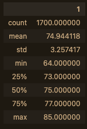
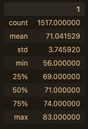

# surfs_up

# **Overview**
### *Purpose of the project:*
___
    The purpose of this project was to display the differences in temperature patterns in Oahu during the months of June and December.

## **Results**
___
### *The following images show the summary for the two months:*
___
### **June**

### **December**

## **Analysis**
___
### *A Summary of the data shows:*
    Oahu, the third largest island part of Hawaii, is very temperate and moderate climate. The two months being compared are in opposing seasons, and exactly half of year apart, and yet their temperature values had very little variation. The mean of both months was only 3 degrees Farenheit, and the difference of their Max temperature was only 2 degrees! The Min for both months was slightly wider, December being 9 degrees lower at it's coldest temp from June's lowest temp. However, considering December the start of winter and the large majority of the Northern Hemisphere is much, much colder this time of year, a 9 degree difference from the start of summer is mild at best. The key factor in lower temperatures would be less sunshine due to shorter days, but during the day, assumedly the temperatures are very similar to June.
    It may be worth noting that December did have fewer measurements taken. However, over the course of only one month, less than 200 measurements total difference would be considered negligible, and more measurements would not have had much of an impact on the final summary statistics.

### Conclusion
___
    Looking at only temperature readings for these two months in opposing seasons, it's no wonder why island inhabitants would love to surf - they can do it all year-round! It's rare that any sport can claim to be truly year-round without some kind of compromise. 
    However, this data only shows temperature. Perhaps the two biggest factors that would involve water sports would be wind speed and rainfall. Also, the amount of daylight during December would greatly impact the activity itself, even if it didn't seem to make much of a difference on the temperature values.

